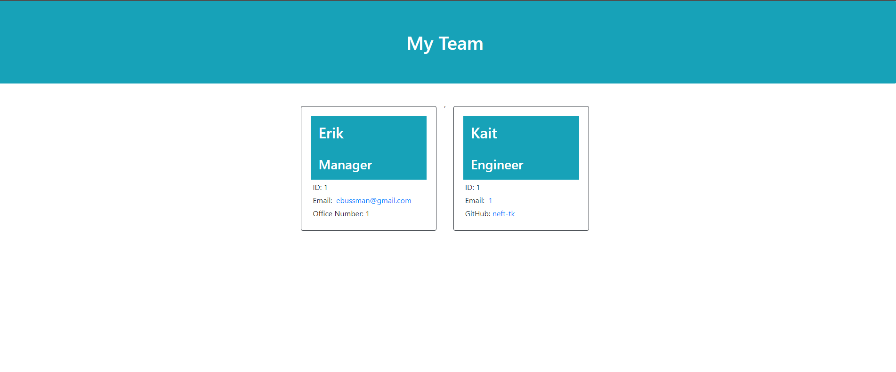

# Team Profile Generator

## Table of Contents
* [Description](#description)
* [Installation](#installation)
* [Usage](#usage)
* [License](#license)
* [Contributing](#contributing)
* [Tests](#tests)
* [Questions](#questions)

## Description 
The Team Profile Generator is a node.js based application that lets the user create an HTML document from their command prompt. The user is able to add (in theory) an infinite amount t of members with their email and various details.

## Installation 
Inquirer and fs.

## Usage 
Run through the integrated terminal in VS Code.

## License 
This project is licensed under the MIT License

## Contributing 
N/A

## Tests 
npm run test

## Questions 
My GitHub username is neft-tk, and you can see more of my work at https://github.com/neft-tk 
You can also reach me at ebussman@gmail.com

